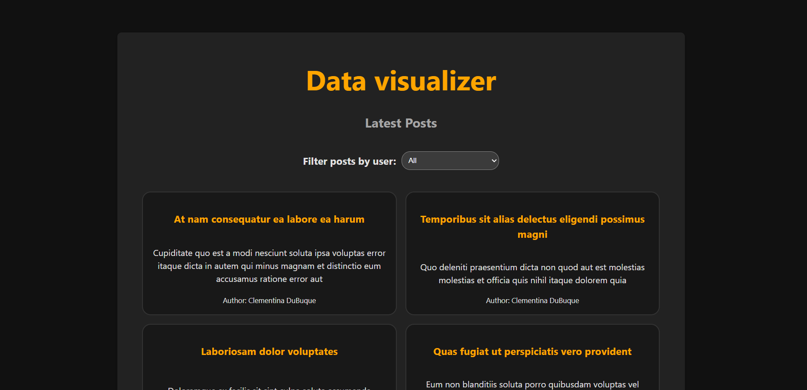

# Data Visualizer Task

### A simple React application for fetching, displaying, and creating posts

---

## Features

- **View Posts:** Fetches and displays the 20 latest posts from the [JSONPlaceholder](https://jsonplaceholder.typicode.com/) API on initial load.
- **Add New Posts:** A form allows users to create new posts, which are dynamically added to the top of the list without a page refresh.
- **Persistent Data:** Newly created posts are saved to `localStorage`, ensuring they remain visible even after a page reload.
- **Filter by User:** A dropdown menu fetches a list of users and allows the displayed posts to be filtered by a specific author.
- **Live Notifications:** Displays a temporary success message after a new post is successfully added.
- **Form Validation:** Ensures all forms are filled before adding the new post.

## Main Page

Displays the first 20 posts.


## Add New Post

On the bottom we have the Add New Post forms.
When we add new post we get notification and we see the newest post at the top.


## Form Validation


## Filter by User

After we Filter by User we see all posts from the selected user


### Installation

1.  **Clone the repository**
    ```sh
    git clone <repo URL>
    ```
2.  **Navigate to the project directory**
    ```sh
    cd <repo name>
    ```
3.  **Install NPM packages**
    ```sh
    npm install
    ```
4.  **Run the development server**
    ```sh
    npm run dev
    ```
